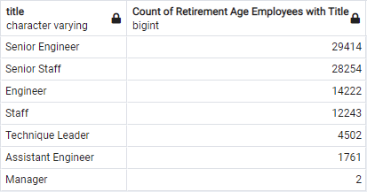
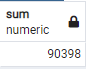
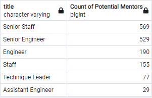
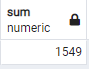
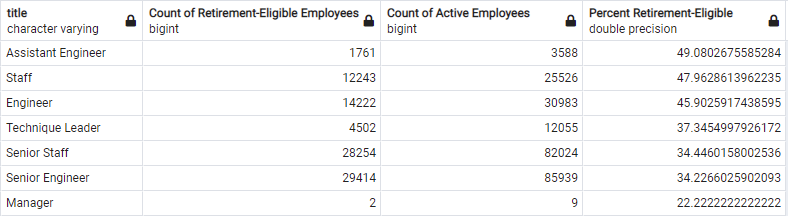

# Employee Retirement Analysis for Pewlett Hackard
## Overview
The purpose of this analysis is to summarize how many employees of the company "Pewlett Hackard" are approaching retirement, based on a database contructed out of provided .csv's. After getting that summary, the analysis will also assess how many of each department's next most senior employees are eligible to become "mentors" to evaluate how much of a danger the newest "silver tsunami" poses to the business. 

## Results
The most insightful parts of this analysis are the Count summaries by title. 
Here is count of soon-to-retire employees by job title:



Takeaways:
* There are over 90,000 employees within the retirement age window (90,398)
* Most of the employees in retirement age are in Senior level positions (57,668 / 90,398 = ~64%)
* Retirement-age employees not in Senior level positions are largely in Mid level (not managerial or assistive) roles (26,465 / 32,730 = ~81%)
* While only 2 Managers are in retirement age, there are only 9 active Managers in the entire company (2 / 9 = 22% of managers soon to retire!)

## Summary
### How many roles will need to be filled as the "silver tsunami" begins to make an impact?
As noted above, 90,398 roles will soon need to be filled as the current generation of most-senior employees retires. To find this we can manually add the results of the previous table, or have SQL do it for us - we have to create a temptable first, as SUM(COUNT(ut.titles)) is illegal in postgreSQL (can't nest aggregate functions):

```
with retiree_counts as (select COUNT(ut.title), ut.title
from unique_titles ut
GROUP BY ut.title
ORDER BY count(ut.title) desc)
select SUM(retiree_counts.count) from retiree_counts
```
Result:




### Are there enough qualified, retirement-ready employees in the departments to mentor the next generation of Pewlett Hackard employees?
For this analysis, "mentorship eligible employees" includes anyone born in 1965 with an active title ("to_date" value of "1/1/9999"). It is worth noting that this is a narrower window than our retiree-eligible selection dates (retiree-eligible includes anyone born from 1952-1955, while mentor-eligible only includes 1965). Based on that difference, we might expect to only find 25% as many employees matching this criteria.

Here are the counts of mentor-eligible employees by title:



We can use a similar sub-query method to get the total sum of these employees:

```
with mentor_counts as (select COUNT(t.title), t.title
from membership_eligibility me
join titles t on t.emp_no = me.emp_no
where t.to_date = '1/1/9999'
GROUP BY t.title
ORDER BY count(t.title) desc)
select SUM(mentor_counts.count) from mentor_counts
```

Result:



To summarize, we might have expected less records (if our employees were evenly distributed by age, then ~15,000) for this mentor-eligible count, but we found significantly less were present. The good news is that a majority of these mentor-eligible employees are already Senior level employees (1,098 / 1,548 = ~71%), but the difference in total number of employees is cause for concern.

This imbalance raises two new questions: 
1. What proportion of our total active employees are nearing retirement?
2. What proportion of our total Senior Level employees are nearing retirement?

### What proportion of Pewlett-Hackard's Total Active Employees are Nearing Retirement?
Here's the SQL to find the summary of total counts by active title:

```
select t.title, COUNT(t.title) as "Count of Active Employees"
from titles t
where t.to_date = '1/1/9999'
group by t.title
order by COUNT(t.title) desc
```

Results:


By using the previously-demonstrated sub-query trick, we can find the total as 240,124 active employees. We already found that 90,398 of those employees were eligible for retirement... that's around 37.6% of Pewlett-Hackard's entire workforce! That's certainly bad news, but we can still hope that our potential losses to the "silver tsunami" are not quite so severe among our Senior Level positions.

### What proportion of Pewlett-Hackard's Active Senior-Level Employees are Nearing Retirement?
By adding a ```INSERT INTO active_counts``` under the ```select``` statement above, we can enable the creation of a joint table showing both our total active employee counts and our soon-to-retire counts. We'll have to do some in-line typecasting which looks a little messy, but it will allow us to show the percentages in the same table:

```
select rt.Title, rt.count as "Count of Retirement-Eligible Employees", 
	ac."Count of Active Employees",
	(CAST(rt.count AS FLOAT) / CAST(ac."Count of Active Employees" AS FLOAT) * 100) as "Percent Retirement-Eligible"
from retiring_titles rt
join active_counts ac on ac.title = rt.title
order by "Percent Retirement-Eligible" desc
```

Results:



Mostly bad news here too, unfortunately. Pewlett-Hackard is poised to lose almost half of their Assistant Engineers, Staff, and Engineers with this approaching "silver tsunami". The upside is that those being Mid-level positions, the company may be able to hire replacements fairly quickly. 

For Senior Level positions, the losses are expected to be above a third of Senior Staff and Senior Engineers. This is about what we expected to find (around the same proportion to our overall losses of active employees to retirement) but it would have been better news to discover that most of our soon-to-be retirees were in less senior positions. Hopefully the issue uncovered in this analysis can aid management in preparing for this significant oncoming loss of employees to retirement.